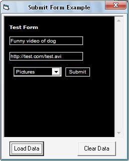



## Submit Data to a Web Form and Press Submit

### Description

Post to a web form from VB. This code is a starter for making an automatic submission or submitter for link sites and dump sites. Or something as simple as logging into a website through your project. I haven't seen any examples on this yet. Please vote if you find this code useful.
 
### More Info
 
This requires Microsoft Internet Controls (shdocvw)

             |
---                |---
**Submitted On**   |2009-02-15 02:22:10
**By**             |[Charles J Butler](https://github.com/Planet-Source-Code/PSCIndex/blob/master/ByAuthor/charles-j-butler.md)
**Level**          |Intermediate
**User Rating**    |5.0 (25 globes from 5 users)
**Compatibility**  |VB 6\.0
**Category**       |[Internet/ HTML](https://github.com/Planet-Source-Code/PSCIndex/blob/master/ByCategory/internet-html__1-34.md)
**World**          |[Visual Basic](https://github.com/Planet-Source-Code/PSCIndex/blob/master/ByWorld/visual-basic.md)
**Archive File**   |[Submit\_Dat2143902152009\.zip](https://github.com/Planet-Source-Code/charles-j-butler-submit-data-to-a-web-form-and-press-submit__1-71768/archive/master.zip)

